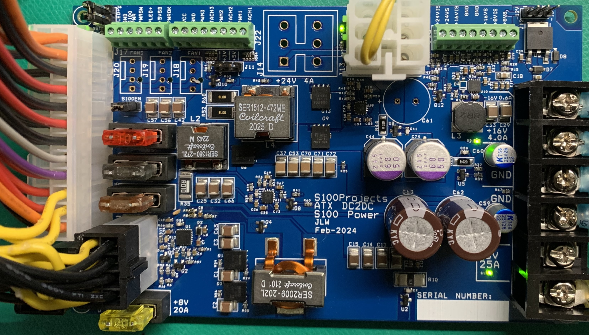
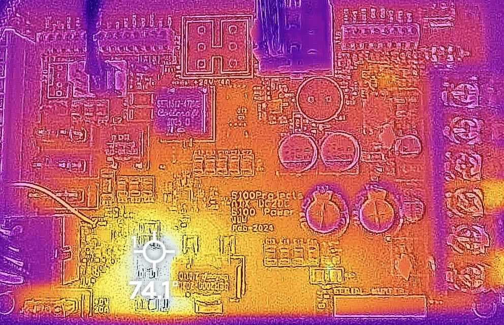
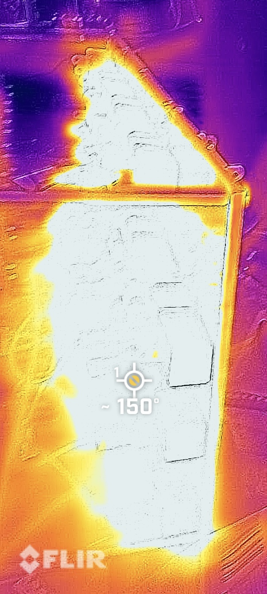

# ATX_DC2DC 
## Project Purpose and Goal ##
<b>The ATX DC2DC power supply board uses a 550W or greater ATX PC power supply (PSU) to generate common S-100 Bus voltages for S-100 computers and floppy disk drives.</b>

<b>Table of Contents:</b>
- [Project Overview](#project-overview)
  - [ATX DC2DC Board Image](#atx-dc2dc-board-image)
  - [ATX DC2DC Board Features](#atx-dc2dc-board-features)
  - [S-100 Voltage Outputs and Currents](#s-100-voltage-outputs-and-currents)
  - [ATX PSU Requirements](#atx-psu-requirements)
  - [ATX DC2DC Jumper Assignments](#atx-dc2dc-jumper-assignments)
- [ATX DC2DC Thermal and Current Limits](#atx-dc2dc-thermal-and-current-limits)
  - [7.5V or 8V Current and Thermal Limits](#7.5v-or-8v-current-and-thermal-limits)
  - [24V Current and Thermal Limits](#24v-current-and-thermal-limits)
  - [16V Current and Thermal Limits](#16v-current-and-thermal-limits)
  - [Fan Requirements above 70% Loading](#fan-requirements-above-70%-loading)
- [Installation and Wiring Requirements](#installation-and-wiring-requirements)

## Project Overview ##

The ATX DC2DC board was implemented as a 5.5" x 3.4" PCB to match the side profile of the common ATX power supply case to allow for using a 3D printed base-plate with double-sided tape to mount the ATX DCDC to the ATX PSU.

### ATX DC2DC Board Image ###

### ATX DC2DC Board Features ###
The ATX DC2DC Board replaces several discrete power supply setups using efficient switching regulator power sections (+7.5V or +8V, +/-16V, and +24) and a readily available ATX PSU of 550 Watts or greater (See <b>ATX PSU Requirements</b> below).

<b>Current Features:</b>
  - Uses ATX Power Connectors (24-pin, 8-pin and 6-pin)
  - Supports common S-100 Voltages
  - Supports common 8" Disk Drive Voltages
  - Three 3/4-pin 12V PC Fan Connectors (with Tach and PWM off-board connections)
  - Microprocessor level (0 to 3.3V) voltage and current monitors for S-100 voltages
  - Over-current and over-temperature shutdown protection
  - Input fuses for each power supply section

### S-100 Voltage Outputs and Currents ###

  | <b>S-100 Output</b>   | <b>Function</b>                       | <b>Default Setting</b>      |
  |----------------|--------------------------------|-----------------------|
  | <b>+7.5V</b> @ 25.0A   | Main Logic Supply on S-100 Bus | <b>~16.4A</b> (20.0A Fuse)   |
  |     - or -          |                                |                              |
  | <b>+8.0V</b> @ 22.0A   | Main Logic Supply on S-100 Bus | <b>~16.4A</b> (20.0A Fuse)   |
  | <b>+16V</b> @ 4.0A     | Logic/Shifter/Analog Supply    | <b>~5.7A</b>   (7.5A Fuse)   |
  | <b>-16V</b> @ 0.5A     | Level Shifter/Analog Supply    | <b>~0.8A</b>   (2.0A Fuse)   |
  | <b>+24V</b> @ 4.0A     | 8in. Floppy Drive Supply       | <b>~8.8A</b>  (10.0A Fuse)   |
  | <b>-5V</b> @ 0.3/0.5A\* | 8in. Floppy Drive Supply       | <b>Int. Limited to 0.5A</b>  |
  | <b>+5V</b> \*\*          | 8in. Floppy Drive Supply       | <b>Limited by ATX PSU</b>    |

\* = 0.3A when -5V Regulator is supplied by -16V Switcher.  
\* = 0.5A when -5V Regulator is supplied by -12V from ATX PSU.  
\*\* = Limited by ATX PSU.

Since not all ATX PSU's supply a -12V voltage (used by the on-board -5V regulator for the 8-in. Floopy Drive Power Connectors), a jumper is provided to optionally supply this -5V regulator from the -16V supply that the ATX DC2DC generates.  Due to dissipation reasons, the current output of the -5V regulator is reduced to 0.3A when driven from the -16V supply.

### ATX PSU Requirements ###

The main determination of which ATX PSU are acceptable are driven by the 12V load of the ATX DC2DC itself and the maximum load present on its outputs.  If you will be using the ATX DC2DC Board at its maximum load limits (as shown above) then you will need at least <b>32 amps</b> at 12V.  However, additional 12V loads such as Fans, Hard-Drives, LEDs, et cetera, will raise this requirement.  As a general rule, it is advised to add 5% or 10% margin to the current requirements to account for unanticipated loads or losses. 

### ATX DC2DC Jumper Assignments ###

  | <b>Jumoer Number</b>  | <b>Description</b>                    | <b>Default Setting/Voltages</b> |
  |----------------|--------------------------------|-----------------------|
  | <b>J1  - 24-Pins</b>  | ATX Main Power Cable           | +3.3V, +5.0V, +12V, -12V                |
  | <b>J2  - 2-Pins</b>    | ATX Power Switch Connection    | Short pins for ATX PSU On               |
  | <b>J3  - 8-Pins</b>    | ATX 12V CPU Power Cable        | +12V when ATX PSU is On                 |
  | <b>J4  - 3-Pins</b>    | ATX Power LED Connection       | Pin 1 - Anode, 3 - Cathode              |
  | <b>J5  - 6-Pins</b>    | ATX 12V PCIE Power Cable       | +12V when ATX PSU is On                 |
  | <b>J10 - 2-Pins</b>    | S-100 Power Enable\*            | Power Enabled when shorted              |
  | <b>J11 - 3-Pins</b>    | Fan VCC Select - (for PWM)     | 1-2=5V, 2-3=3.3V                        |
  | <b>J12 - 3-Pins</b>    | -5V In Select (-12/-16)        | 1-2=-12V, 2-3=-16V                      |
  | <b>J13/14 - 3-Pins</b> | 8-in Drive Power Sockets       | 2/3/6=GND, 1=+24V, 4=-5V, 5=5V          |
  | <b>J15 - 6-Pins</b>    | S-100 Bus Voltage Outputs      | 1/2=+7.5V, 3/4=GND, 5=+16V, -16V        |
  | <b>J16 - 8-Pins</b>    | Voltage/Current Monitor Output | (See V/I Monitor Pinout)                |
  | <b>J17 - 6-Pins</b>    | Control/Status Port            | (See Control/Status Port Pinout)        |
  | <b>J18-20 - 4-Pins</b> | PC Fan Connections             | 1=GND, 2=+12V, 3=TACH, 4=PWM            |
  | <b>J23-26 - 2-Pins</b> | Power Supply Fuses             | J23=+7.5V, J24=+16V, J25=+24V, J26=-16V |
  
## ATX DC2DC Thermal and Current Limits ##

As shown above, the ATX DC2DC S-100 Power Supply Board can provide >350W of S-100 voltages, typically at 95%+ efficiency.

Even at those efficiency levels though, you will still have close to 18-watts of heat dissipation at full load.  The board can dissipate, with natural convection (under 25C ambient conditions), up to approximately 12-watts of heat safely without the need of a fan in a typical 25C environment. (Note - most of this heat is generated by the 7.5V/8.0V regulator section of the board).  Above that limit, a 60mm or larger fan is required to avoid thermal shutdowns and possible damage to the ATX DC2DC board.

As an example, the folowing characterization image was taken of the ATX DC2DC's 7.5V output at 25A loading with a resistor "Load Box".

In the above image the white region (at 74.1C) is the heat generated by the 7.5V/8V Switching Regulator MOSFETs when supplying 25 amps when forced-air cooled with a 60mm PC fam (which is driven off of the on-board PC fan connectors).  74.1C represents a die temperature of ~94.1C.  Since the MOSFET absolute maximum temperature is 150C, this represents 56C of headroom, or up to 76C ambient temperature.  I have derated this slightly to an operational range of 0C to 70C for most uses of the board.

Note: The two yellow temperatures areas to the lower right of the image are the +7.5V and Ground connections to the resistor load box and represent the heat genrated by the wire resistance when conducting 25 amps of current.

This test was made with a resistor load box to dissipate the 187-watts of heat generated.  For the curious, here is a picture of the load box when under full load.  I have since added a fan to the load box for longevity reasons since 150C is at the limit for the resistors used.

### 7.5V or 8V Current and Thermal Limits ###

Due to the thermal constraints shown above, the current limits for the 7.5V and 8V versions of the ATX DC2DC are catagorized into four catagories accomoding to these operational limits.  The categories are 7.5V vs 8V and Fanless vs Fan cooling.

  | <b>Operational Mode</b> | <b>Current Limit</b> | 
  |------------------|-----------------|
  | <b>7.5V - No Fan</b>    | 17 Amps       |
  | <b>8.0V - No Fan</b>    | 15 Amps       |
  | <b>7.5V - 60mm Fan</b>  | 25 Amps       |
  | <b>8.0V - 60mm Fan</b>  | 22 Amps       |

  These are characterized limits, but convection currents, airflow patterns, and venting efficiencies within different enclosures can vary wildly, so please error on the side of caution.  More airflow is generally better. 

### 24V Current and Thermal Limits ###

The 24V 8" drive supply section behaves similarly to that of the 7.5v/8V section.  Above 2.7-amps of continuous loading, a fan is required.  Startup currents are generally not a factor in the thermal limits described here.

### 16V Current and Thermal Limits ###

The 16V section takes advantage of an efficient MOSFET than can be used in the 24V section (primarily because the higher switching voltages in the 24V section did mot allow for using the more efficient MOSTFET).

However, since the 16V section does use the more efficient MOSFET, it does not require a fan to achieve its full loading of 4-amps.  A fan may still be required depending on the loading for the other output voltages.

### Fan Requirements above 70% Loading ###

Regardless of the individual current loadings, whenever the output currents are 70% or higher of the total current limits, a fan should be used.

## Installation and Wiring Requirements ##

For the lowest voltage drop (cable loss) of the power cables to the S-100 Bus and 8in. Drives, please follow the following chart for wire sizes according to load current:

  | <b>Output @ Amps</b>   | <b>Wire Type</b>                       | <b>Wire Gauge</b>      |
  |----------------|--------------------------------|-----------------------|
  | <b>+7.5V</b> @ 25.0A (J15)    | 1-Wire 7-strand or higher copper | <b>10-Guage</b>      |
  | <b>+7.5V</b> @ 25.0A (J15)    | 2-Wire 7-strand or higher copper | <b>18-Guage</b>      |
  | <b>+8.0V</b> @ 25.0A (J15)    | 1-Wire 7-strand or higher copper | <b>10-Guage</b>      |
  | <b>+8.0V</b> @ 22.0A (J15)    | 2-Wire 7-strand or higher copper | <b>18-Guage</b>      |
  | <b>+16V</b>  @ 4.0A  (J15)    | 1-Wire 7-strand or higher copper | <b>20 or 22-Guage</b>|
  | <b>-16V</b>  @ 0.5A  (J15)    | 1-Wire 7-strand or higher copper | <b>20 or 22-Guage</b>|
  | <b>+24V</b>  @ 4.0A  (J13/14) | 1-Wire 7-strand or higher copper | <b>20 or 22-Guage</b>|
  | <b>-5V</b>   @ 0.5A  (J13/14) | 1-Wire 7-strand or higher copper | <b>20 or 22-Guage</b>|
  | <b>+5V</b>   @ 4.0A  (J13/14) | 1-Wire 7-strand or higher copper | <b>20 or 22-Guage</b>|

NOTE: On PVC vs THHN - THHN (Teflon Coated Wire) does not increase the current carrying capability of a wire.  It does increase the temperature rating before failure.  Simply put, it can dissipate more heat so a smaller wire can be used, but it comes at the cost of a larger voltage drop and more losses in the cable.  However, THHN can be used at the above wire guage limits as it offers better abrasion resistance, heat tolerance, and is easier to pull through tight spaces due to its Teflon coating.

